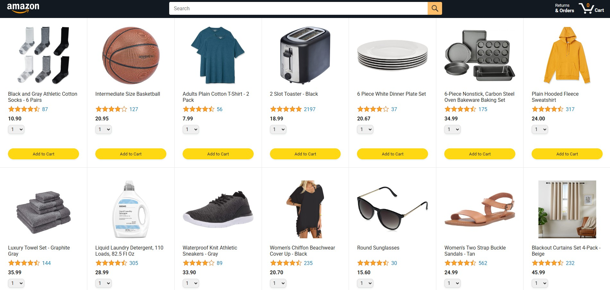
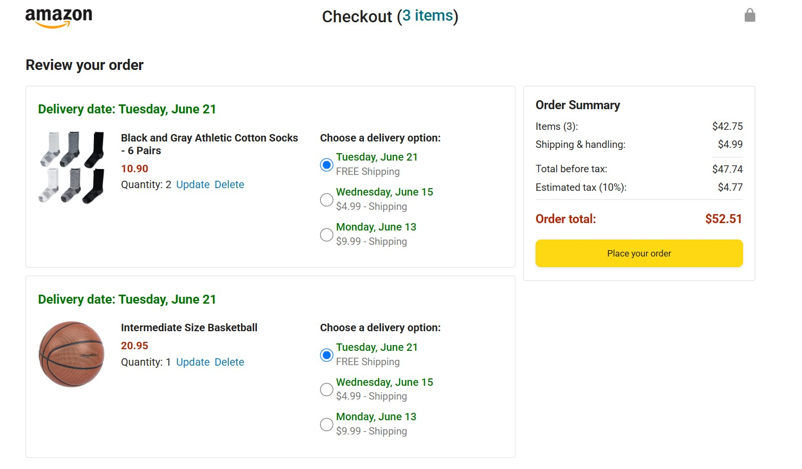

# 🛒 ecommerce-amazon-js

  
  
  

Amazon-inspired **eCommerce front-end clone** built with **HTML, CSS, and Vanilla JavaScript**.  
This project replicates some core functionalities of an online shopping platform like Amazon — with clean UI, responsive design, and interactive features — all built **without external frameworks**. ✨  

---

## 📸 Screenshots

### 🏠 Home Page


### 💳 Checkout Page


---

## ⚡ Features

- ✅ **Responsive Design** — optimized for different screen sizes  
- ✅ **Product Listing Pages** — dynamically rendered products from `products.js`  
- ✅ **Shopping Cart** — add, update, and delete items in the cart  
- ✅ **Checkout Flow** — order summary and tracking functionality  
- ✅ **Vanilla JavaScript Only** — no external libraries or frameworks  

---

## 📂 Project Structure

ecommerce-amazon-js/
│── backend/ # Backend-related files (HTML/CSS)
│── data/ # Product data (products.js, etc.)
│── images/ # Screenshots + UI assets
│── scripts/ # JavaScript files for functionality
│── styles/ # CSS files for styling
│── amazon.html # Product listing (Amazon-like home)
│── checkout.html # Checkout page
│── orders.html # Order details
│── tracking.html # Tracking page
│── README.md # Project documentation


---

## 🚀 Getting Started

1. Clone the repo:
   ```bash
   git clone https://github.com/ranjan-uprety/ecommerce-amazon-js.git


Open amazon.html in your browser to explore the project.

🎯 Future Improvements

Add user authentication

Implement backend with Node.js/Express

Integrate real product API

Improve UI/UX with animations

📜 License

This project is licensed under the MIT License – feel free to use and modify.

💡 Inspiration

This project was built as part of learning JavaScript fundamentals and practicing real-world application by cloning Amazon’s shopping flow.